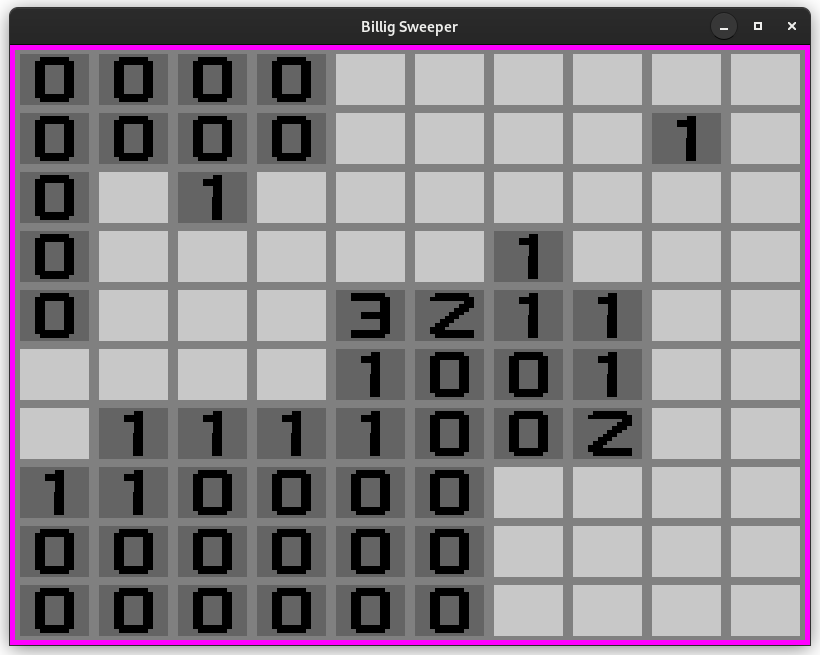

# Billig-Sweeper
This is a just another simple minesweeper clone.



# Usage
```
billig-sweeper [-h]
```

## Keybindings

|  Key  | Actions          |
|-------|------------------|
|   F1  | Open Github link |
| ESC/m | Open menu        |
|   r   | Restart game     |
|   q   | Quit             |

## Config
The game settings are saved in a config file.
There you can also change the background color.
The config file is searched in:
- $XDG_CONDIG_DIR/billig-sweeper/config.toml
- $HOME/.config/billig-sweeper/config.toml


# Installation

## Dependencies
- meson (build-time)
- GIMP (only for editing `graphics.xcf`)
- libSDL2
- libSDL2_image

### Arch/Manjaro
```
sudo pacman -S base-devel meson sdl2 sdl2_image
```

### Debian/Ubuntu
```
sudo apt update
sudo apt install build-essential meson libsdl2-dev libsdl2-image-dev
```

### RHEL/Fedora
```
sudo dnf install gcc meson sdl2-devel sdl2_image-devel
```

## Building
```
git clone https://github.com/riscygeek/billig-sweeper
cd billig-sweeper
```

### Meson
```
meson setup build
meson compile -C build
meson install -C build
```

### Autotools-like configure (experimental)
```
./configure
make
sudo make install
```

Note:

This project must be installed to work,
if you just want to try it out,
you should add `--prefix=$PWD/tmp` to `meson setup build` or `configure`.

# TODO
- Add a config file
    - background color
    - keybinds
- Enable support for Wayland.
- Add a help menu (for keybinds)
